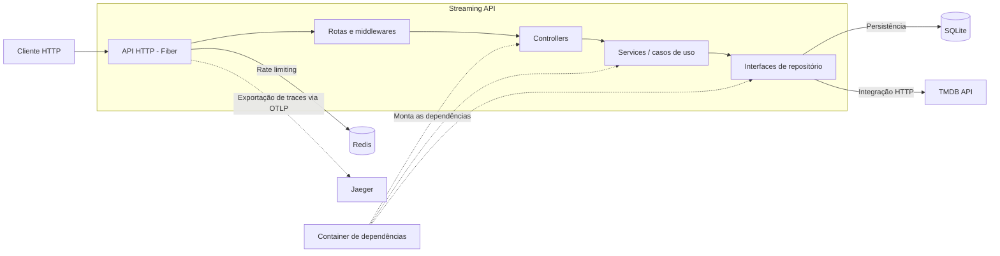

<h1 align="center">Streaming API</h1>

<p align="center">

</p>

> [!IMPORTANT]
> _Esse projeto está em desenvolvimento._

### Tópicos

- [📖 Descrição do projeto](#descricao-do-projeto)
  - [Funcionalidades Principais](#funcionalidades-principais)
- [🛠️ Tecnologias](#tecnologias)
- [🏗️ Arquitetura](#arquitetura)
  - [Organização do código](#organização-do-código)
  - [Arquitetura do Software](#arquitetura-do-software)
- [🔌 Endpoints](#endpoints)
  - [Autenticação](#autenticação)
  - [Perfis](#perfis)
  - [Conteúdos](#conteúdos)
  - [Favoritos](#favoritos)
- [▶️ Projeto em funcionamento](#projeto-em-funcionamento)
- [🚀 Como rodar o projeto](#como-rodar-o-projeto)
  - [Pré-requisitos](#pré-requisitos)
  - [Configuração](#configuração)
  - [Executar com Docker Compose](#executar-com-docker-compose)
  - [Executar os testes](#executar-os-testes)
  - [Gerar relatório de cobertura](#gerar-relatório-de-cobertura)
- [👥 Colaboradores](#colaboradores)

<a id="descricao-do-projeto"></a>
## 📖 Descrição do projeto

O Streaming API é uma aplicação backend desenvolvida em Go para gerenciamento de usuários, perfis, catálogo de filmes e séries e favoritos.

A API expõe endpoints REST protegidos por autenticação JWT e integra-se à API externa TMDB para consulta e busca de conteúdos. Os dados de usuários, perfis e favoritos são persistidos em SQLite.

O projeto também conta com rate limiting nas rotas de autenticação, suporte opcional ao Redis, documentação interativa com Swagger, health check e tracing distribuído com OpenTelemetry e Jaeger.

### Funcionalidades Principais

> **Autenticação:** Registro, login e consulta dos dados do usuário autenticado utilizando tokens JWT.

> **Gerenciamento de perfis:** Criação, edição, exclusão e listagem de perfis associados ao usuário.

> **Catálogo de conteúdos:** Listagem, busca e filtragem de filmes e séries por meio da integração com a API TMDB.

> **Gerenciamento de favoritos:** Adição, listagem e remoção de filmes e séries favoritos por perfil.

> **Rate limiting:** Limitação de requisições nas rotas de registro e login para reduzir tentativas excessivas.

> **Observabilidade:** Instrumentação das requisições da API e das chamadas à TMDB com OpenTelemetry, exportando traces para o Jaeger.

> **Documentação:** Interface Swagger para consulta e testes dos endpoints disponíveis.

> **Health check:** Endpoint para verificar a disponibilidade da API.

<a id="tecnologias"></a>
## 🛠️ Tecnologias

<details closed>
<summary>Linguagens e Frameworks</summary>
  <div width="140px">
      
  </div>
</details>

<details closed>
<summary>Bancos de Dados e Armazenamento</summary>
  <div width="140px">
      
  </div>
</details>

<details closed>
<summary>DevOps, Cloud e Infraestrutura</summary>
  <div width="140px">
      
  </div>
</details>

<details closed>
<summary>Ferramentas</summary>
  <div width="140px">
      
  </div>
</details>

<a id="arquitetura"></a>
## 🏗️ Arquitetura

### Organização do código

A aplicação utiliza uma arquitetura em camadas, separando o transporte HTTP, os casos de uso, a persistência e as integrações externas.

O projeto também utiliza injeção manual de dependências, interfaces para abstração dos repositórios e mocks para facilitar os testes unitários. A organização possui elementos inspirados na Clean Architecture, mas não pretende representar uma implementação estrita de DDD ou Clean Architecture: os services ainda utilizam DTOs da API e os models são compartilhados com a camada de persistência.

```
src/
├── api
│   ├── routes
│   └── v1
│       ├── controllers
│       ├── dto
│       ├── validators
│       └── responses
├── configs
│   ├── db
│   ├── env
│   └── tracing
├── container
├── middlewares
├── mocks
│   ├── repositories
│   └── services
├── models
├── repositories
│   ├── http
│   ├── interfaces
│   └── sqlite
├── security
├── services
│   └── interfaces
└── shared
```

| Camada | Responsabilidade |
| ------ | ---------------- |
| `api` | Inicializa a aplicação Fiber, configura middlewares e registra as rotas da API. |
| `routes` | Define os endpoints e conecta cada rota ao controlador correspondente. |
| `controllers` | Recebe as requisições HTTP, trata parâmetros e delega a lógica para os serviços. |
| `dto` | Estruturas de entrada e saída para transporte de dados entre camadas. |
| `validators` | Valida payloads, campos obrigatórios e regras de negócio básicas antes do processamento. |
| `responses` | Padroniza as respostas da API em formato JSON e erros estruturados. |
| `configs` | Centraliza configuração de variáveis de ambiente, banco de dados, cache e tracing. |
| `container` | Monta e injeta as dependências entre controladores, serviços e repositórios. |
| `middlewares` | Implementa autenticação, autorização e interceptadores de requisição. |
| `models` | Representa as entidades do domínio e as estruturas principais do sistema. |
| `repositories` | Gerencia acesso a dados em SQLite, Redis e integrações externas. |
| `services` | Contém a lógica de negócio da aplicação e orquestra operações entre domínio e persistência. |
| `security` | Responsável por JWT, hashing de senha e autenticação/segurança do usuário. |
| `shared` | Reúne constantes, erros, normalizações e utilidades reutilizáveis. |
| `mocks` | Simula dependências para testes unitários, facilitando isolamento e validação. |

### Arquitetura do Software

A aplicação funciona no modelo cliente-servidor. O cliente envia requisições HTTP para a API Fiber, que encaminha as chamadas pelas rotas e middlewares até os controllers. Os controllers delegam os casos de uso aos services, que utilizam interfaces de repositório para acessar o SQLite e a integração externa com a TMDB.



O Redis é utilizado pelo rate limiter das rotas de autenticação. Quando o Redis não está disponível, a aplicação utiliza o armazenamento padrão em memória do limiter. O OpenTelemetry instrumenta as requisições da API e as chamadas HTTP para a TMDB, exportando os traces para o Jaeger.

<a id="endpoints"></a>
## 🔌 Endpoints

A API está organizada sob o prefixo `/v1` e, em sua maior parte, utiliza autenticação por token JWT no header `Authorization`.

### Autenticação

| Método | Rota | Descrição |
| ------ | ---- | --------- |
| `POST` | `/v1/auth/register` | Cria um novo usuário na aplicação |
| `POST` | `/v1/auth/login` | Realiza login e retorna o token de acesso |
| `GET`  | `/v1/auth/me` | Retorna os dados do usuário autenticado |

### Perfis

> Todos os endpoints abaixo exigem autenticação.

| Método | Rota | Descrição |
| ------ | ---- | --------- |
| `GET` | `/v1/profiles` | Lista os perfis do usuário autenticado |
| `POST` | `/v1/profiles` | Cria um novo perfil associado ao usuário |
| `PUT` | `/v1/profiles/:id` | Atualiza um perfil específico |
| `DELETE` | `/v1/profiles/:id` | Remove um perfil do usuário |

### Conteúdos

> Todos os endpoints abaixo exigem autenticação.

| Método | Rota | Descrição |
| ------ | ---- | --------- |
| `GET` | `/v1/contents` | Lista os conteúdos disponíveis para o usuário autenticado |
| `GET` | `/v1/contents/search` | Busca conteúdos por termo ou filtro específico |

### Favoritos

> Todos os endpoints abaixo exigem autenticação.

| Método | Rota | Descrição |
| ------ | ---- | --------- |
| `GET` | `/v1/favorites` | Lista os itens favoritos do usuário |
| `POST` | `/v1/favorites` | Adiciona um item à lista de favoritos |
| `DELETE` | `/v1/favorites` | Remove um item favorito pelo perfil, conteúdo e tipo |

<a id="projeto-em-funcionamento"></a>
## ▶️ Projeto em funcionamento

Clique na imagem abaixo para assistir ao tutorial em vídeo!

[](semvideo.com)

**Descrição**: Este vídeo cobre todo o processo para visualizar o projeto em funcionamento, do início ao fim.

<a id="como-rodar-o-projeto"></a>
## 🚀 Como rodar o projeto

### Pré-requisitos

- Go 1.26.1 ou superior
- Docker e Docker Compose
- Um token de acesso da API TMDB

### Configuração

Copie o arquivo de exemplo para criar as variáveis de ambiente locais:

```bash
cp .env.example .env
```

Depois, edite o arquivo `.env` e informe o valor de `TMDB_ACCESS_TOKEN`.

> O arquivo `.env` não deve ser versionado. Para execução local, o projeto utiliza valores de desenvolvimento para o `JWT_SECRET`.

### Executar com Docker Compose

```bash
docker compose up --build
```

Para executar os containers em segundo plano:

```bash
docker compose up --build -d
```

Após a inicialização, os serviços estarão disponíveis em:

- API: http://localhost:8080
- Health check: http://localhost:8080/health
- Swagger: http://localhost:8080/swagger/index.html
- Jaeger: http://localhost:16686

### Executar os testes

```bash
go test ./... -v
```

### Gerar relatório de cobertura

```bash
go test ./... -v -coverprofile=coverage.out
go tool cover -func=coverage.out
```

Para encerrar os containers:

```bash
docker compose down
```

Consulte também o [DOCKER.md](./DOCKER.md) para outros comandos relacionados ao ambiente Docker.

<a id="colaboradores"></a>
## 👥 Colaboradores

| [<br><sub>Kauê Bertaze de Oliveira</sub>](https://github.com/KaueTTS)<br><sub>Software Engineer</sub> |
| :---:
